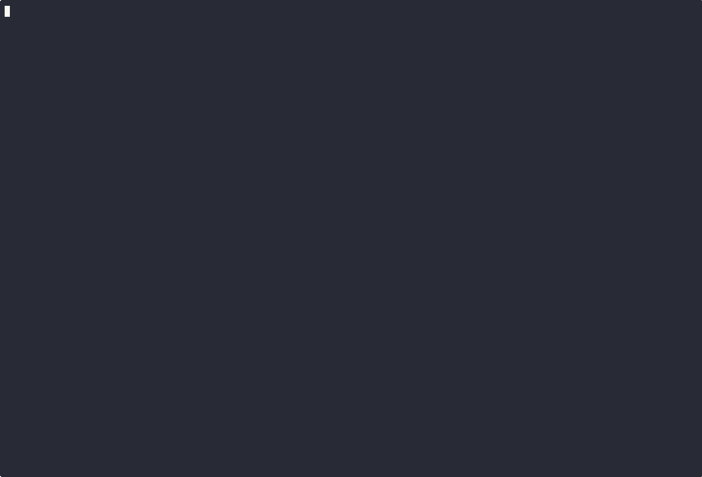

# r2l - a Rust Reinforcement Learning Library

> [!WARNING] > **Pre-Alpha:** This library is under active development. APIs may change, documentation is sparse, features may be added or removed, and bugs should be expected.

**r2l** is a minimalist reinforcement learning library written in Rust, designed to be customizable, ergonomic, and easily embeddable.

## Why r2l

Despite the simple nature of most reinforcement learning algorithms, existing implementations often introduce hidden complexity.
Libraries like Stable Baselines3 include many build-in features that are not part of the original design and makes reasoning about
the code harder. r2l takes a different approach by exposing key parts of the training loop through a hook system. This allows for more flexibility
in logging, analysis and experimentation. Furthermore the hook system allows easy integration into the wider Rust ecosystem, allowing
for the easy creation of TUI/GUI applications.

<p align="center">
  
  <br/>
  <em>An example of embedding r2l in a terminal application</em>
</p>

## What's included

**r2l** is organized as a set of crates:

- **`r2l-core`** – Defines the core abstractions for reinforcement learning (environments, policy, ...). Also contains a minimal set of on-policy algorithms like PPO.
- **`r2l-gym`** – A wrapper around Python's Gym environments.
- **`r2l-macros`** – Provides procedural macros to simplify implementing and registering hooks.
- **`r2l-tui`** – A TUI application that demonstrates how to embed r2l into [`ratatui`](https://github.com/ratatui-org/ratatui).

## How to use it

Set up a PPO agent:

```rust
let env = GymEnv::new("Pendulum-v1", None, &Device::Cpu)?;
let (input_dim, out_dim) = env.io_sizes();
let builder = PPOBuilder {
    input_dim,
    out_dim,
    ..Default::default()
};
let mut agent = builder.build()?;
```

### Adding a batching hook

Suppose you want to observe and print the policy loss during training. You can define a batching hook like this:

```rust
fn batch_hook(policy_loss: &mut PolicyLoss) -> candle_core::Result<bool> {
    println!("policy loss: {}", policy_loss.to_scalar::<f32>()?);
    Ok(false)
}
```

Register it with the agent:

    agent.hooks.set_batching_hook(batch_hook);

### Hook function flexibility

Batch hook functions can accept any subset of the following arguments:

    policy: &mut PolicyKind,
    rollout_batch: &RolloutBatch,
    policy_loss: &mut PolicyLoss,
    value_loss: &mut ValueLoss,
    data: &PPOBatchData,

For example, if you'd like to log both the policy loss and a derived quantity from the rollout data:

```rust
fn batch_hook(policy_loss: &mut PolicyLoss, data: &PPOBatchData) -> candle_core::Result<bool> {
    println!("policy loss: {}", policy_loss.to_scalar::<f32>()?);
    println!("logp diff: {:?}", data.logp_diff.deref());
    Ok(false)
}
```

### Training

After this, you can run the training loop, and your terminal should display both the policy loss and the logp diffs:

```rust
let env_pool = DummyVecEnv {
    n_env: 1,
    env,
    rollout_mode: RolloutMode::StepBound { n_steps: 1024 },
};
let learning_schedule = LearningSchedule::new(100);
let mut algo = OnPolicyAlgorithm::new(env_pool, agent, learning_schedule);
algo.train()?;
```

For a more advanced and interactive example, see the [`r2l-tui`](./r2l-tui) crate.

## Roadmap

**Current version: `v0.0.1`**  
The project is in an early experimental phase. Expect missing features, frequent breaking changes, bugs, and everything in between.

### `v0.1.0` – Core Algorithm Coverage (SB3 parity)

- Implement all algorithms available in [Stable Baselines3](https://github.com/DLR-RM/stable-baselines3)
- Add benchmarks for simple environments (e.g. CartPole, Pendulum)
- Introduce a high-level builder API for setting up agents with established hooks for logging, observability, and training control
- Expect significant API changes

### `v1.0.0` – Extended Algorithm Set (Tianshou parity)

- Implement remaining algorithms from [Tianshou](https://github.com/thu-ml/tianshou)
- Finalize the hook and training APIs
- Provide stable interfaces for embedding, visualization, and training control
- Improve documentation, examples, and possibly add multi-agent support

**Future directions may include:**

- `r2l-gui` using `egui`
- Snapshotting via SafeTensors or ONNX
- TensorBoard integration for monitoring

# Contributing

Any and all contributions are welcome. If you have a feature request, let me know by opening an issue about it, but please understand that while
the project is ambitious, there are no corporate backers and I work on it in my spare time.
