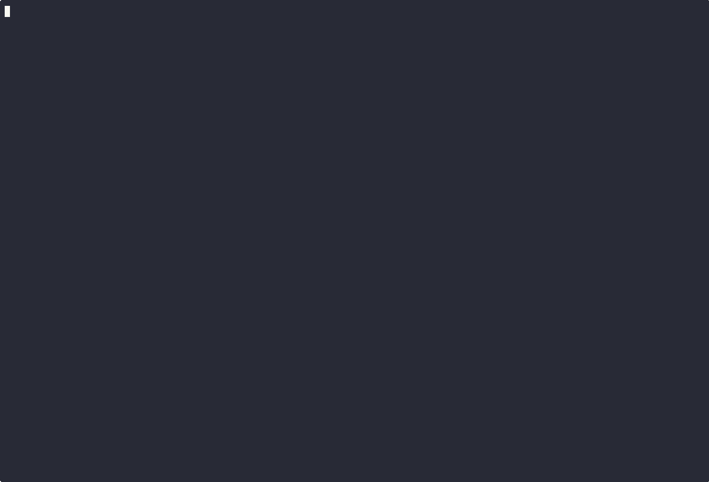

# r2l - a Rust Reinforcement Learning Library

> [!WARNING]  
> **Pre-Alpha:** This library is under active development. Current APIs are
> almost surely going to change in the future and documentation might not be up
> to date.

## Why **r2l**

The goal of **r2l** is to be a customizable, ergonomic and easily embeddable
library. To be more exact:

- **Customizable**: the user has great control influencing _how_ agents are
  trained. While **r2l** defines how different components interact with each
  other, and the core logic of they implement, it also exposes the internals
  through a hook system for the user.
- **Ergonomic**: most users are not necessarily concerned with implementation
  details. In order to alleviate the burden of implementing a complete
  algorithm, building on the core components, **r2l** aims to implement commonly
  setups.
- **Embeddable**: my goal with **r2l** is to be able to use it within a diverse
  set of applications/environments. Instead of choosing a single deep learning
  framework, **r2l** uses traits to describe it's needs. In practice, we
  currently support **candle** and **burn**. If you have a deep learning
  framework, and would like to have **r2l** support it, open a PR/make an issue.

<p align="center">
  
  <br/>
  <em>An example of embedding r2l in a terminal application</em>
</p>

The scope of **r2l** is what Stable Baselines3 covers (by version 0.1.0) and
Tianshou (by version 1.0.0). On top of core algorithms, a hyperparameter tuning
library is to be included in the future.

> [!WARNING] > **Pre-Alpha:** This library is under active development. APIs may
> change, documentation is sparse, features may be added or removed, and bugs
> should be expected.

**r2l** is a minimalist reinforcement learning library written in Rust, designed
to be customizable, ergonomic, and easily embeddable.

## Getting started

You can get started if you have `gymnasium` like so:

```rust
use std::{
    sync::mpsc::{self, Receiver, Sender},
    thread,
};

use candle_core::Device;
use r2l_api::{
    LearningSchedule, PPOAlgorithmBuilder, PPOStats, SamplerExecutionMode, StepTrajectoryBound,
};

fn main() {
    let (update_tx, update_rx): (Sender<PPOStats>, Receiver<PPOStats>) = mpsc::channel();
    let ppo_builder = PPOAlgorithmBuilder::gym("Pendulum-v1", 10)
        .with_normalize_advantage(true)
        .with_candle(Device::Cpu)
        .with_burn()
        .with_entropy_coeff(0.2)
        .with_gradient_clipping(Some(0.5))
        .with_target_kl(Some(0.01))
        .with_bound(StepTrajectoryBound::new(2048))
        .with_execution_mode(SamplerExecutionMode::Vec)
        .with_clip_range(0.2)
        .with_learning_schedule(LearningSchedule::rollout_bound(300))
        .with_reporter(Some(update_tx));
    let mut ppo = ppo_builder.build().unwrap();
    let t = thread::spawn(move || {
        while let Ok(stats) = update_rx.recv() {
            println!("avg reward: {}", stats.average_reward);
        }
    });
    ppo.train().unwrap();
    drop(ppo);
    t.join().unwrap();
}
```

For more information, read the [book](https://afgthecat.github.io/r2l/).

## Roadmap

**Current version: `v0.0.2-rc2`** The project is in an early experimental phase.
Expect missing features, frequent breaking changes, bugs, and everything in
between.

### `v0.1.0` – Core Algorithm Coverage (SB3 parity)

- Implement all algorithms available in
  [Stable Baselines3](https://github.com/DLR-RM/stable-baselines3)
- Add benchmarks for simple environments (e.g. CartPole, Pendulum)
- Introduce a high-level builder API for setting up agents with established
  hooks for logging, observability, and training control
- Expect significant API changes

### `v1.0.0` – Extended Algorithm Set (Tianshou parity)

- Implement remaining algorithms from
  [Tianshou](https://github.com/thu-ml/tianshou)
- Finalize the hook and training APIs
- Provide stable interfaces for embedding, visualization, and training control
- Improve documentation, examples, and possibly add multi-agent support

**Future directions may include:**

- Snapshotting via SafeTensors or ONNX
- TensorBoard integration for monitoring

# Contributing

Any and all contributions are welcome. If you have a feature request, let me
know by opening an issue about it, but please understand that while the project
is ambitious, there are no corporate backers and I work on it in my spare time.
