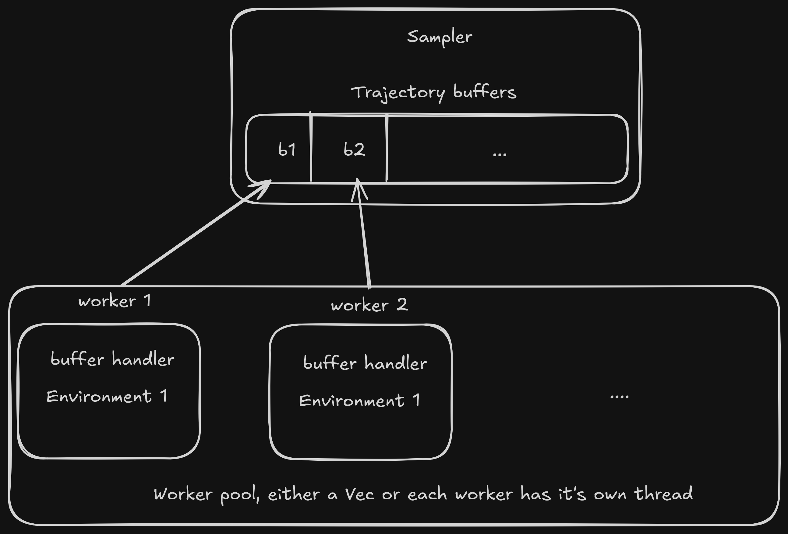

> [!WARNING]  
> This is a bit of a dumping ground on how **r2l** is architected. Not always
> coherent.

## On policy algorithms

The `OnPolicyAlgorithm` struct is intentionally kept minimal. It consists of the
following components:

- The `sampler` collects the trajectories
- The `agent` updates the policy
- The `hooks` orchestrate the training loop through an `init_hook`, a
  `post_rollout_hook`, a `post_training_hook` and a `shutdown_hook`

<details open>
<summary>On policy algorithm</summary>

```rust
{{#include ../../crates/r2l-core/src/on_policy/algorithm.rs:on_policy_algorithm}}
```

</details>

Supported algorithms and capabilities are defined by a combination of these
components. An illustrative example of how different components could work
together:

1. The `init_hook` sets up the pre requisits for the algorithm, such as setting
   up a log file or spawning a progress bar in a gui
2. The `sampler` receives the current policy, runs multiple environments in
   paralell or sequentially, and fills up the trajectory buffers
3. The `post_rollout_hook` updates the progress bar, checks whether a target
   rollout count has been achieved, if so it jumps to step 6
4. The `agent` receives the trajectory buffers and updates the policy
5. The `post_training_hook` checks how the policy performs in a newly spawned
   environment, logs the results, updates a progress bar, and if the policy does
   well enough, jumps to step 6, otherwise jumps to step 2.
6. The `shutdown_hook` shuts down the worker threads, saves the best performing
   `policy`, runs a final evaluation and prints the results

Below is a schematic overview of the training loop and the actual implementation
of the training loop.


<details open>
<summary>Training loop implementation</summary>

```rust
{{#include ../../crates/r2l-core/src/on_policy/algorithm.rs:train_loop}}
```

</details>

Another important thing here is that both `Sampler` and `Agent` defines a
`Tensor` type. The `OnPolicyAlgorithm` can be used so long as the `Tensor` types
can be converted using the `From` trait.

## The sampler

The sampler is responsible for collecting the rollouts. Samplers need to
implement the sampler trait.

<details open>
<summary>Sampler trait</summary>

```rust
{{#include ../../crates/r2l-core/src/on_policy/algorithm.rs:sampler}}
```

</details>

While `r2l-core` does not give an implementation, `r2l-sampler` does provide
one. The current `R2lSampler` provided can run the environments on a single
thread, or using multiple threads in paralell. The current sampler does not
implement hooks, but that is going to change soonish.



What is important here to note, is that trajectory containers lives inside an
`ArrayHandle` that contains all the trajectory buffers, while the individual
workers are only allowed to touch their own buffer through an `ElementHandle`.

```rust
{{#include ../../crates/r2l-sampler/src/lib.rs:r2l_sampler}}
```

## The agents

The agents is responsible for coordinating the training.

<details open>
<summary>Sampler trait</summary>

```rust
{{#include ../../crates/r2l-core/src/on_policy/algorithm.rs:sampler}}
```

</details>

## PPO

The idea of the PPO is not explained here. For that, check the paper.

Within **r2l**, PPO is hookable at three separate points:

1. Before learning begins
2. After the minibatching, before moving forward to the next rollout
3. During minibatching, before the update has been called

Within **r2l-api**, a default implementation of the hook system is provided.
