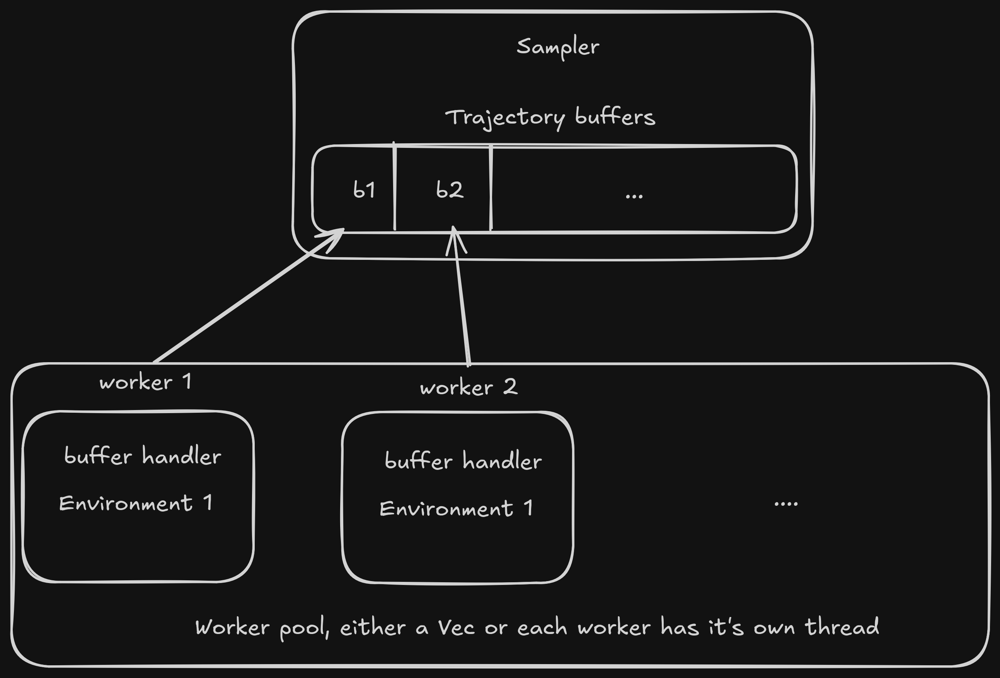

## On-policy algorithms

`r2l` separates an on-policy training run into four components:

- an `Agent` owns the trainable policy and learns from trajectory batches;
- a `Sampler` collects trajectories with a snapshot of the current actor;
- an `OnPolicyAdapters` implementation bridges backend tensor types when
  necessary;
- `OnPolicyAlgorithmHooks` controls initialization, stopping, evaluation, and
  shutdown.

`OnPolicyAlgorithm` holds a runtime and a hook implementation. Its training
loop repeatedly collects rollouts, invokes the post-rollout hook, updates the
agent, and invokes the post-training hook. A hook can stop the loop by returning
`HookResult::Break`.

The public traits and their method contracts are documented in the
[`r2l-core` API](https://docs.rs/r2l-core/0.0.2/r2l_core/on_policy/algorithm/).

## Samplers

`r2l-sampler` provides two sampler implementations:

- `DirectSampler` lets workers write transitions directly to output buffers;
- `StagedSampler` receives transitions from workers and can update and apply
  clipped observation normalization before committing trajectories.

Both samplers support `SamplerExecutionMode::SingleThreaded`, which steps
environments on the current thread, and
`SamplerExecutionMode::MultiThreaded`, which assigns each environment to a
worker thread. Gymnasium environments still execute Python code under Python's
interpreter lock, so threaded sampling should not be assumed to improve
Gymnasium throughput.

Rollout collection is hook-driven. `StepHookBound` and `EpisodeHookBound`
provide the standard fixed-step and fixed-episode policies through the
high-level API.

## Agents

`r2l-agents` contains the lower-level PPO, A2C, and VPG learning logic.
`r2l-api` composes those agents with Candle or Burn learning modules and
provides defaults for loss configuration, reporting, evaluation, and learning
schedules.

Most applications should construct a complete run with
`PPOAlgorithmBuilder` or `A2CAlgorithmBuilder`. The lower-level
`PPOAgentBuilder`, `A2CAgentBuilder`, and `SamplerBuilder` are intended for
custom compositions.

## PPO hooks

The PPO agent exposes hooks at three points:

1. after advantages and return targets are computed;
2. after each PPO epoch, where the hook decides whether another epoch runs;
3. after a minibatch loss is computed and before the optimizer update.

The default `r2l-api` hook uses these points for advantage normalization,
entropy and value-loss coefficients, target-KL stopping, progress reporting,
and statistics.

## A2C hooks

The A2C agent exposes hooks before minibatching, before each optimizer update,
and after all minibatches have been processed. The default hook provides
advantage normalization, entropy and value-loss coefficients, reporting, and
statistics.
