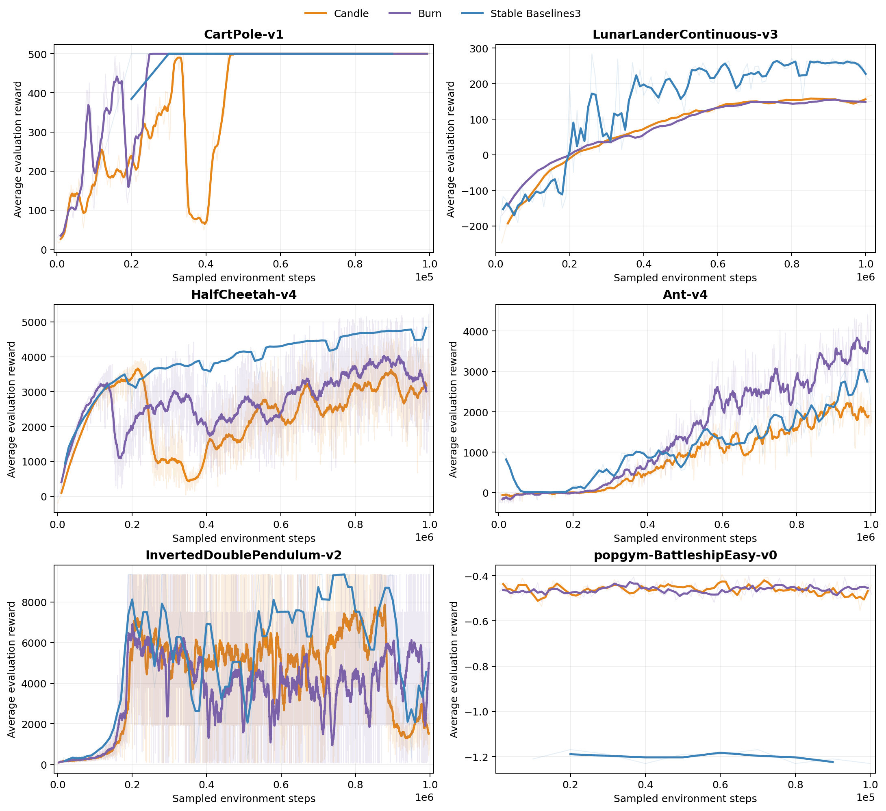

# Results

> [!WARNING] These results are preliminary. Each configuration currently has one
> seeded run; repeated runs and deeper analysis will be added as the benchmark
> suite develops.

The current results are primarily a broad integration test for r2l's PPO
implementation. They exercise both supported tensor backends across classic
control, Box2D, MuJoCo, Bullet, and partially observable environments. Stable
Baselines3 (SB3) runs provide a familiar reference implementation.

## Setup

All three implementations use the per-environment PPO configurations in the
[benchmark configuration](https://github.com/afgTheCat/r2l/blob/main/benchmark/assets/ppo.yaml),
which are based on RL Baselines3 Zoo settings. The r2l runs use the same
configuration for the Candle and Burn backends. Training is seeded with `0`,
while evaluation follows each implementation's existing evaluation path.

The current snapshot contains evaluation data for 28 environments on each r2l
backend and Stable Baselines3. The figure below shows six representative
environments from the completed run.

The horizontal axis below is the number of environment interactions sampled
during training. Faint lines show the recorded evaluation values and solid lines
show moving averages. The plot is generated by
[`book/scripts/plot_results.py`](https://github.com/afgTheCat/r2l/blob/main/book/scripts/plot_results.py).

_Selected learning curves from the completed run. Higher reward is better, but
reward scales should only be compared within an environment._

## Reading these results

The strongest signal in the current data is breadth: both r2l backends train
through the same public API and produce improving policies across several
families of environments. The Candle and Burn curves also provide an early check
that the algorithm behaves consistently across tensor implementations.

These curves are useful for finding implementation problems, but they should not
yet be interpreted as a ranking of frameworks. In particular:

- Each framework and environment currently has only one seeded training run.
  Reinforcement-learning outcomes can vary substantially between seeds.
- Evaluation frequency and the number of episodes averaged into a point are not
  identical between r2l and SB3. Comparing broad learning behavior is more
  meaningful than comparing individual points.
- SB3 requests deterministic evaluation actions, while the current r2l evaluator
  calls the actor's regular `action` method. This difference should be removed
  before treating the curves as a controlled comparison.
- The plots do not show confidence intervals because repeated runs are not yet
  available.
- The current environment selection is not intended to be comprehensive.
- Training-time comparisons require a controlled hardware and software setup;
  the timing artifacts are therefore not presented as backend benchmarks yet.

## Planned additions

Future benchmark passes will add repeated seeds, uncertainty bands, and
controlled throughput measurements. The chapter will be updated as those results
become available.
