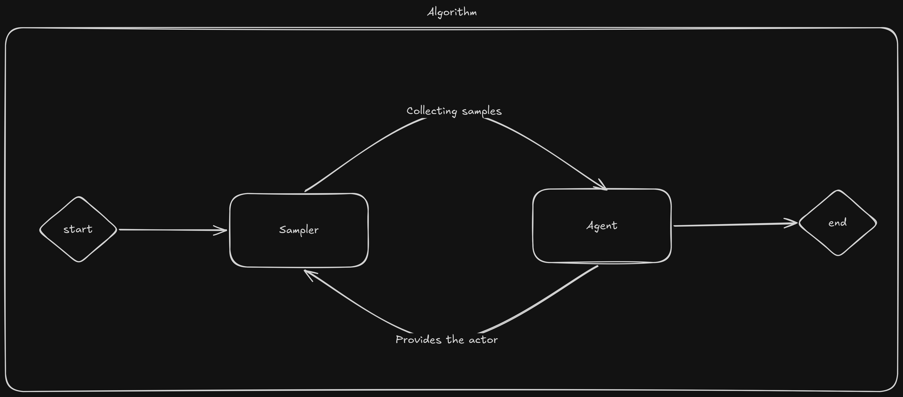

## Too long, don't care

Check out the [examples](#examples). They go over how to implement the `Env`
trait and train an agent with **a2c**/**ppo** with.

## Context

The chapter introduces

- how to work with environments, whether you are defining your own, or the ones
  provided by `gymnasium`.
- how to use the builder API to work with these environments.

Currently, we only support on policy algorithms. This will change in the future
and more algorithms will be covered. While **r2l** composes of multiple crates,
only the following are necessary to get started:

- `crates/r2l-api`: shared API-facing types and interfaces,
- `crates/r2l-core`: core RL abstractions including `R2lTensor`, `Env` and
  `EnvBuiler`,
- `crates/r2l-gym`: wrapper around `gym` environments, if you don't already have
  an environment already.

The `r2l-api` crate itself builds on top of many other `r2l` crates and is
designed to be easy to use, but limited in flexibility. The goal here, it to
reach the functionality of Stable Baselines3 (we are not there yet), and to
validate the hooks based architecture. That architecture is not discussed here,
for details check out the [On policy algorithms](./on_policy_algorithms.md) and
[Off policy algorithms](./off_policy_algorithms.md) chapter.

## Core concepts of on-policy training in **r2l**

Within **r2l**, the on policy algorithm's learning loop consist of two stages

- collecting samples using the `Sampler`
- processing the samples is done by the `Agent`

The `Algoritm` is responsible for running the loop until a fixed amount of
steps/episodes have elapsed. The simplified overview is presented down.


The `r2l-api` exposes builder for `Sampler`s, `Agent`s and `Algorithm`s. While
it is possible to construct `Sampler`s and `Agent`s, most users would probably
prefer constructing algorithms, as they expose the same level of control as the
downstream building blocks, just with a higher level API.

| Builder               | Builder type      | Produces                           | Notes                                                                                                       |
| --------------------- | ----------------- | ---------------------------------- | ----------------------------------------------------------------------------------------------------------- |
| `SamplerBuilder`      | Sampler builder   | `R2lSampler`                       | Useful when you want to pair rollout collection with your own agent or algorithm setup.                     |
| `PPOAgentBuilder`     | Agent builder     | `PPOBurnAgent` or `PPOCandleAgent` | Builds the policy update component only; pair it with a sampler when not using `PPOAlgorithmBuilder`.       |
| `A2CAgentBuilder`     | Agent builder     | `A2CBurnAgent` or `A2CCandleAgent` | Similar to `PPOAgentBuilder`, but for A2C training.                                                         |
| `PPOAlgorithmBuilder` | Algorithm builder | A configured PPO `Algorithm`       | The highest-level PPO entry point; combines environment setup, sampler construction and agent construction. |
| `A2CAlgorithmBuilder` | Algorithm builder | A configured A2C `Algorithm`       | The highest-level A2C entry point; usually the simplest way to start training with A2C.                     |

## Environments

In order to use `r2l` (or any other rl library for that matter) an environments
needs to be constructed. The environment trait is defined as.

```rust
{{#include ../../crates/r2l-core/src/env.rs:env}}
```

Notice that the `Env` trait is neither `Sync` nor `Send`. For some environments,
we cannot make these guarantees. An example would be dynamically loading a
shared library that has no constructors and uses global variables. Picture a
simulator that uses
[an embedded controller](https://betaflight.com/docs/development/SITL) in the
simulation loop.

Since **r2l** support multithreading, environments like these needs to be
constructed on the host thread. For this reason, the `EnvBuilder` trait is
introduced to be an argument for builders that need to eventually create the
environment.

```rust
{{#include ../../crates/r2l-core/src/env.rs:env_builder}}
```

The simplest `EnvBuilder` possible is a closure or function that returns a new
instance of the environment. As an example, if `MyEnv` implements the `Env`
trait, the below closure can work as an `EnvBuilder`.

```rust
let number_of_environmnets = 10;
let env_builder = || Ok(MyEnv);
let ppo_builder = PPOAlgorithmBuilder::new(env_builder, number_of_environmnets);
```

For more examples on how to implement the `Env` and `EnvBuilder` trait, check
the [environments](#examples-environments) section of the examples.

### Gym environments

Gym environments from `gymnasium` are implemented in `gym-env` crate. Currently
`Discrete` and `Box` action spaces can be used. A gym environment is wrapped by
the `GymEnv` struct, while `GymEnvBuilder` can be used to construct a `gym`
environment. Algorithm builders exposed by `r2l-api` handle gym environments
through a dedicated `gym` constructor.

```rust
// anyhin that implements the Into<GymEnvBuilder> can be used with `gym`
let ppo_builder = PPOAlgorithmBuilder::gym("Pendulum-v1", 10);
```

A sidenote on `gym` environments: while it is possible to use a
`ThreadEnvironment`, thanks to the GIL, true parallelism is not going to happen.

## SamplerBuilder

The current sampler supported by **r2l** is called `R2lSampler` and has the
following feature set.

| Feature                    | Status | Description                                                   | Blocked on                                    |
| -------------------------- | ------ | ------------------------------------------------------------- | --------------------------------------------- |
| Episode based sampling     | ✅     | Collects trajectories based the number of episodes completed  |                                               |
| Steps based sampling       | ✅     | Collects trajectories based the number of steps taken         |                                               |
| Observation normalization  | ❌     | Normalizes observations using rms                             | Sampler hooks (v.0.0.3)                       |
| Reward normalization       | ❌     | Normalized rewards using rms                                  | Sampler hooks (v.0.0.3)                       |
| Vec environments           | ✅     | Trajectories are collected in sequentially on the same thread |                                               |
| Thread environments        | ✅     | Trajectories are collected in paralell using multi threading  |                                               |
| Subprocessing environments | ❌     | Trajectories are collected in a separate subprocesses         | Subprocessing environments (probably v.0.0.4) |

You can construct the sampler using the `SamplerBuilder`.

```rust
let gym_env_builder = GymEnvBuilder::new("Pendulum-v1");
let sampler_builder = SamplerBuilder::<GymEnvBuilder>::new(gym_env_builder, 10)
    .with_location(Location::Vec)
    .with_location(Location::Thread)
    .with_bound(EpisodeTrajectoryBound::new(10))
    .with_bound(StepTrajectoryBound::new(1000));
let sampler = sampler_builder.build();
```

It is also possible to implement your own sampler, for more info check the
relevant section of the [On policy algorithms](./on_policy_algorithms.md)
chapter.

## AgentBuilders

While `A2CAgentBuilder` and `PPOAgentBuilder` differ in what `Agent` they are
going to build, they do share a lot of the configuration options.

| Method                      | Argument(s)                                                                  | Purpose                                                                    |
| --------------------------- | ---------------------------------------------------------------------------- | -------------------------------------------------------------------------- |
| `Self::new`                 | `n_envs: usize`                                                              | Creates the agent builder configured for the given number of environments. |
| `with_candle`               | `device: Device`                                                             | Selects the Candle backend and the device to run on.                       |
| `with_burn`                 | none                                                                         | Selects the Burn backend.                                                  |
| `with_normalize_advantage`  | `normalize_advantage: bool`                                                  | Enables or disables advantage normalization before optimization.           |
| `with_entropy_coeff`        | `entropy_coeff: f32`                                                         | Sets the entropy bonus coefficient used to encourage exploration.          |
| `with_vf_coeff`             | `vf_coeff: Option<f32>`                                                      | Sets the value-function loss coefficient.                                  |
| `with_gradient_clipping`    | `gradient_clipping: Option<f32>`                                             | Enables gradient norm clipping and sets the clipping threshold.            |
| `with_gamma`                | `gamma: f32`                                                                 | Sets the discount factor for future rewards.                               |
| `with_lambda`               | `lambda: f32`                                                                | Sets the lambda parameter used for return / advantage estimation.          |
| `with_policy_hidden_layers` | `policy_hidden_layers: Vec<usize>`                                           | Configures the hidden-layer sizes of the policy network.                   |
| `with_learning_rate`        | `learning_rate: f64`                                                         | Sets the optimizer learning rate.                                          |
| `with_beta1`                | `beta1: f64`                                                                 | Sets the Adam/AdamW `beta1` parameter.                                     |
| `with_beta2`                | `beta2: f64`                                                                 | Sets the Adam/AdamW `beta2` parameter.                                     |
| `with_epsilon`              | `epsilon: f64`                                                               | Sets the Adam/AdamW epsilon value.                                         |
| `with_weight_decay`         | `weight_decay: f64`                                                          | Sets the optimizer weight decay.                                           |
| `build`                     | `observation_size: usize, action_size: usize, action_space: ActionSpaceType` | Builds the final agent from the configured builder.                        |

### A2C agent builder

A2C is a synchronous, deterministic variant of A3C. For more info, check the
[paper](https://arxiv.org/abs/1602.01783). It is implemented as an `Agent`
within `r2l`. `A2CAgentBuilder` exposes no extra parameters on top of the common
ones. An example on how to use this is:

```rust
let a2c_algo = A2CAgentBuilder::new(10)
    .with_burn()
    .with_normalize_advantage(true)
    .with_entropy_coeff(0.)
    .with_vf_coeff(None)
    .with_policy_hidden_layers(vec![32, 32])
    .build(10, 2, ActionSpaceType::Discrete);
```

### PPO agent builder

The Proximal Policy Optimization algorithm combines ideas from A2C and TRPO .
For more, check the [paper](https://arxiv.org/abs/1707.06347). It is implemented
as an `Agent` within `r2l`.

```rust
let ppo_algo = PPOAgentBuilder::new(10)
    .with_candle(Device::Cpu)
    .with_burn()
    .with_normalize_advantage(true)
    .with_entropy_coeff(0.)
    .with_vf_coeff(None)
    .with_gradient_clipping(None)
    .with_gamma(0.)
    .with_lambda(0.)
    .with_policy_hidden_layers(vec![32, 32])
    .with_learning_rate(3e-4)
    .with_beta1(0.9)
    .with_beta2(0.999)
    .with_epsilon(1e-5)
    .with_target_kl(Some(0.3))
    .with_clip_range(0.5)
    .with_weight_decay(1e-4);
```

## Algorithm builders

```rust
let gym_env_builder = GymEnvBuilder::new("Pendulum-v1");
let sampler_builder = SamplerBuilder::<GymEnvBuilder>::new(gym_env_builder, 10)
    .with_location(Location::Thread)
    .with_bound(StepTrajectoryBound::new(1000));
let agent_builder = PPOAgentBuilder::new(10).with_normalize_advantage(true);
let algo_builder =
    OnPolicyAlgorithmBuilder::from_sampler_and_agent_builder(sampler_builder, agent_builder)
        .with_learning_schedule(LearningSchedule::rollout_bound(10))
        .with_learning_schedule(LearningSchedule::total_step_bound(1000));
```

## Examples {#examples}

Below are some examples how to use `r2l-api`, which provides builders and APIs
for the most commonly used usecases. R2l is highly extensible, and if you are
curious about the how to extend it/use it, start at
[architecture](./architecture.md).

### Environments {#examples-environments}

The below example shows implementing the `Env` trait and different
implementations of the `EnvBuilder`.

```rust
{{#include ../../crates/r2l-examples/examples/env_building/main.rs:env_builders}}
```

### PPO {#examples-ppo}

```rust
{{#include ../../crates/r2l-examples/examples/ppo/main.rs:ppo}}
```

### A2C {#examples-a2c}

```rust
{{#include ../../crates/r2l-examples/examples/a2c/main.rs:a2c}}
```
